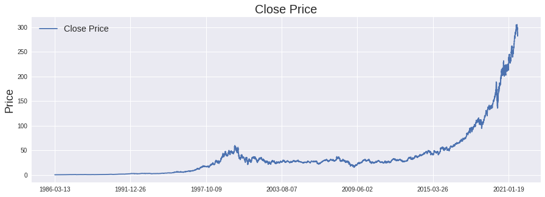
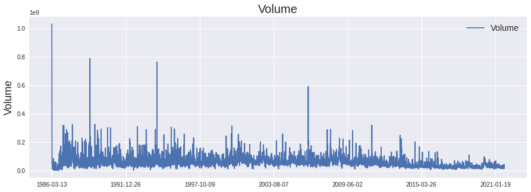
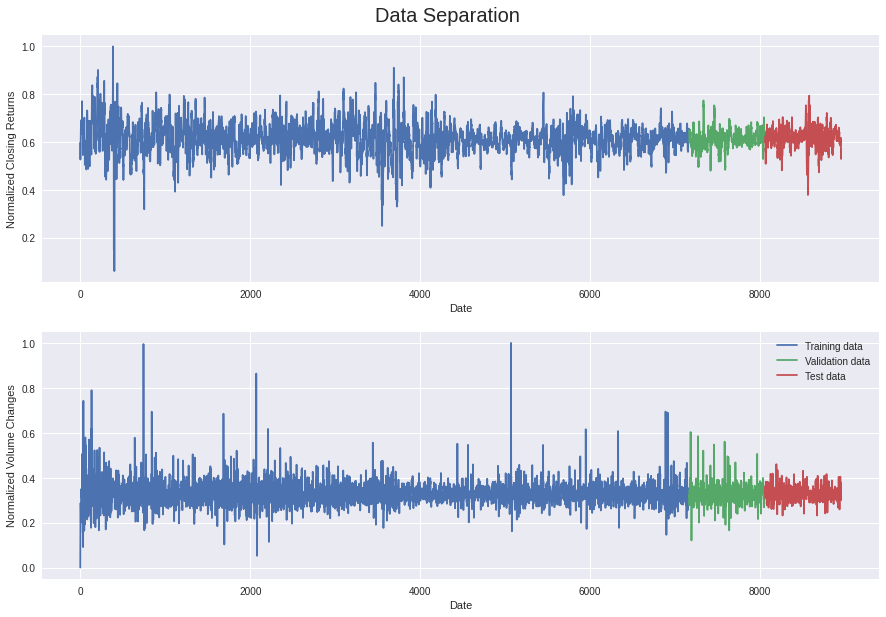
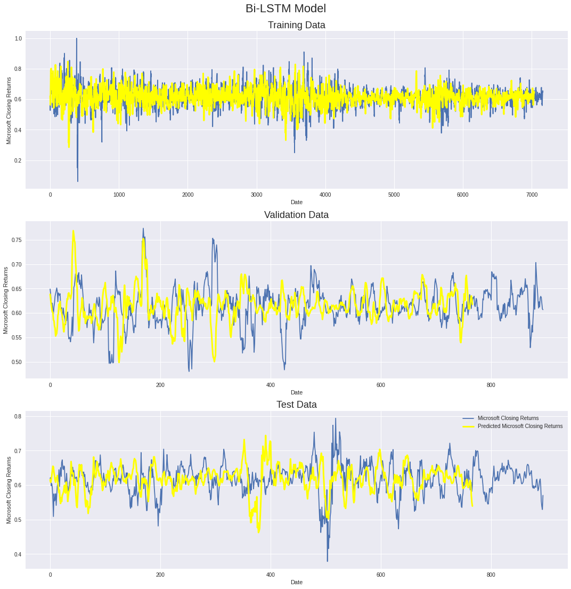
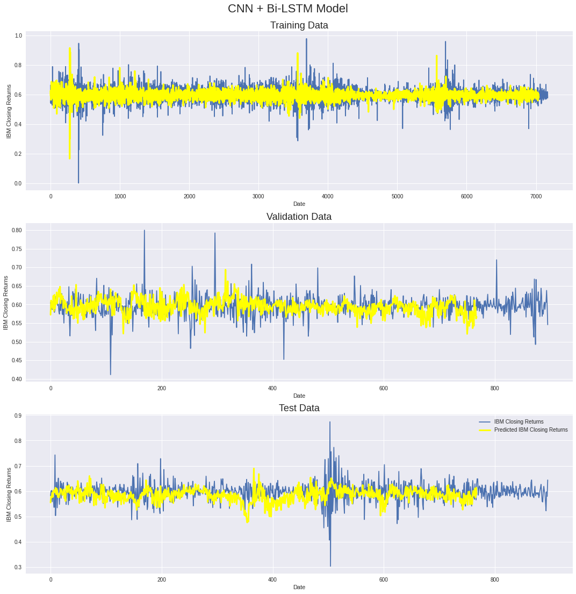
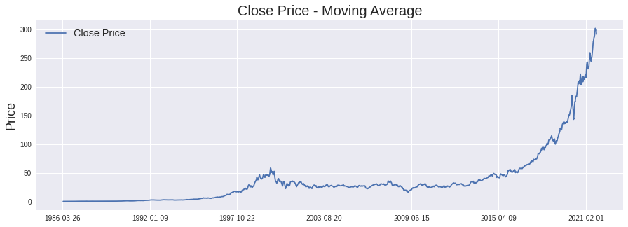
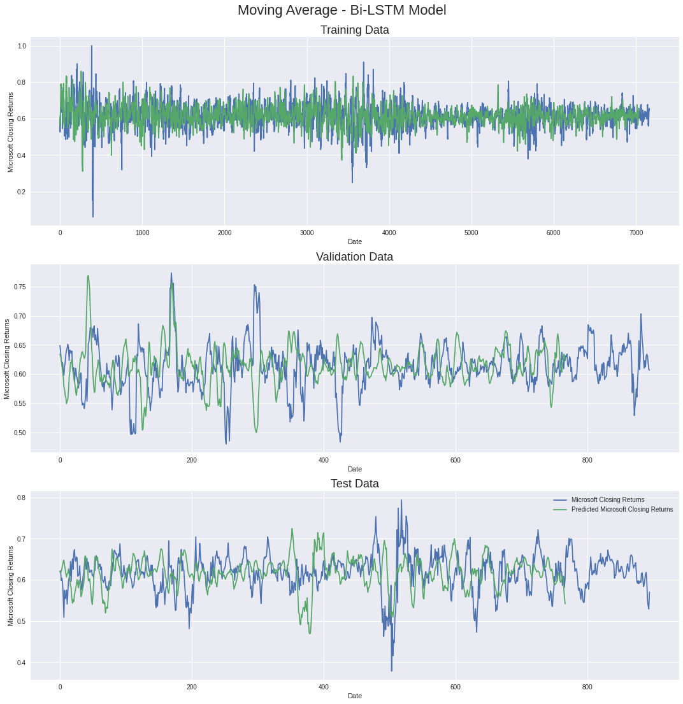
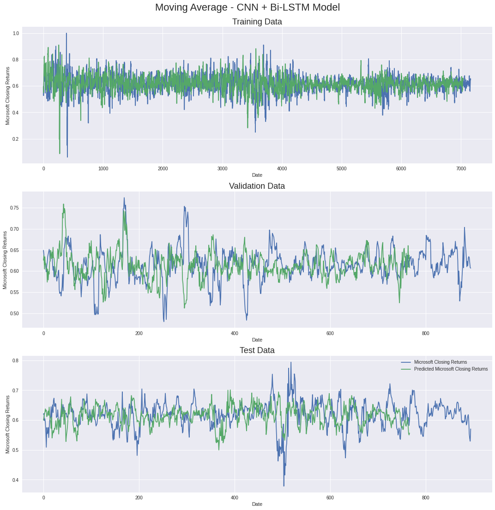

# nn-statistical-reinforcement
Reinforcing Sequential Neural Networks with statistical indicators including.

[x] Moving Average
[ ] Moving Average Convergence Divergence
[ ] Relative Strength Index
[ ] 

***

## Data

We use the historical data for the adjusted stock price from **Yahoo Finance** for the following shares:

- **Microsoft** ('MSFT')
- **Apple**     ('AAPL')
- **IBM**       ('IBM')

For the purpose of this demo, we'll only be explaining the data for **MSFT**. We consider the **Closing Price** and **Volume** for the stock in question.

*Closing Price*

*Volume*

> The data is then split and normalised to obtain the following training/validation/test split:

*Data-Split*

From hereon, we are good to build and train the models.

***
## Models

1. Multi-layer Perceptron
    - *Hidden Layers* - 2
    - *Batch Size* - 128
    - *Input Features* - Open | High | Low | Close | Volume

2. Uni-Directional LSTM
    - *Layers* - 3 (128 Units | 128 units | 64 units)
    - *Batch Size* - 128
    - *Dropout* - 0.1
    - *Activation* - ReLU

3. Bi-Directional LSTM
    - Bidirectional + Same architecture as Uni-LSTM

4. CNN + Bi-Directional LSTM
    - Added reinforcement of Conv1D layers for Bi-LSTM

Separate experiments were conducted with and without the inclusion of statistical indicators.
***

## Training and Testing

Following are the prediction plots for MSFT Experiments -

1. Bi-LSTM

2. CNN+Bi-LSTM

We now integrate Moving Average as an additional feature ->

3. Moving Average + Bi-LSTM

4. Moving Average + CNN + Bi-LSTM

It seems that the right and left tail of the stock return distribution are not derivable from price data alone.

I do have the following **hypotheses** that provide more room for investigation and might lead to better results.
***

## Results

Following are the key results from all the experiments conducted.

1. **IBM** 

|        Model       | Loss (Val) | MAE (Val) | MAPE (Val) | Loss (Test) | MAE (Test) | MAPE (Test) |
|:------------------:|------------|-----------|------------|-------------|------------|-------------|
| Bi-LSTM            | 0.0009     | 0.0210    | 3.5852     | 0.0016      | 0.0252     | 4.3891      |
| CNN+Bi-LSTM        | 0.0010     | 0.0234    | 3.9355     | 0.0017      | 0.0278     | 4.7458      |
| **MA + Bi-LSTM**   | **0.0005** |**0.0172** | **3.1902** | **0.0009**  | **0.0207** | **4.1954**  |
| MA + CNN + Bi-LSTM | 0.0008     | 0.0218    | 4.0254     | 0.0016      | 0.0284     | 5.8967      |

2. **MSFT**

|        Model       | Loss (Val) | MAE (Val) | MAPE (Val) | Loss (Test) | MAE (Test) | MAPE (Test) |
|:------------------:|------------|-----------|------------|-------------|------------|-------------|
| **Bi-LSTM**        | **0.0003** | **0.0131**| **2.1428** | **0.0006**  | **0.0178** | 2.9333      |
| CNN+Bi-LSTM        | 0.0012     | 0.0248    | 4.1523     | 0.0022      | 0.0343     | 5.8016      |
| MA + Bi-LSTM       | 0.0004     | 0.0136    | 2.2168     | **0.0006**  | 0.0180     | **2.9178**  |
| MA + CNN + Bi-LSTM | 0.0005     | 0.0172    | 2.8074     | 0.0009      | 0.0213     | 3.5096      |

3. **AAPL**

|        Model       | Loss (Val) | MAE (Val) | MAPE (Val) | Loss (Test) | MAE (Test) | MAPE (Test) |
|:------------------:|------------|-----------|------------|-------------|------------|-------------|
| Bi-LSTM            | 0.0007     | 0.0193    | 2.5894     | 0.0012      | 0.0202     | 3.3391      |
| CNN+Bi-LSTM        | 0.0012     | 0.0201    | 2.8251     | 0.0014      | 0.0228     | 3.8274      |
| **MA + Bi-LSTM**   | **0.0005** |**0.0162** | **2.1902** | **0.0007**  | **0.0183** | **2.8954**  |
| MA + CNN + Bi-LSTM | 0.0007     | 0.0187    | 2.5632     | 0.0011      | 0.0196     | 3.4967      |

## Conclusion

Based on the outputs of the various models, the following conclusions can be made ->

- The rugged nature of the stock returns makes the networks interpret the distribution tails as semi-random thus significantly marring the prediction performance.
- This issue is dealt with elegantly by the addition of moving average as a feature to the input data.
- The predictions for the Bi-LSTM and CNN+Bi-LSTM models predicted the trend of the movement rather than the actual price and hence, the stats are slightly misleading in terms of model performance.
- More price data is needed to derive temporal dependencies of the time series and get a better understanding of the distribution tails.
- When applying a moving average effect to a time series your dataset represent the real market less accurately. Subsequently, the dataset is biased towards less outliers.
- Slight smoothing of the time series improved the error rates substantially for the Bi-LSTM and CNN+Bi-LSTM models. It is a good thing to consider for future research.
- Up next, we'll be looking for other prediction indicators which will be adding to the model's performance. 
